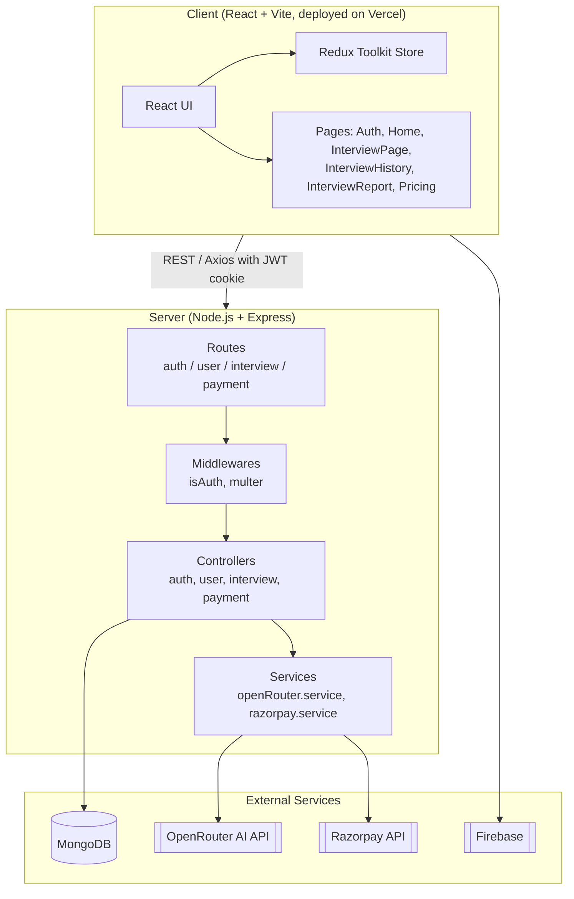
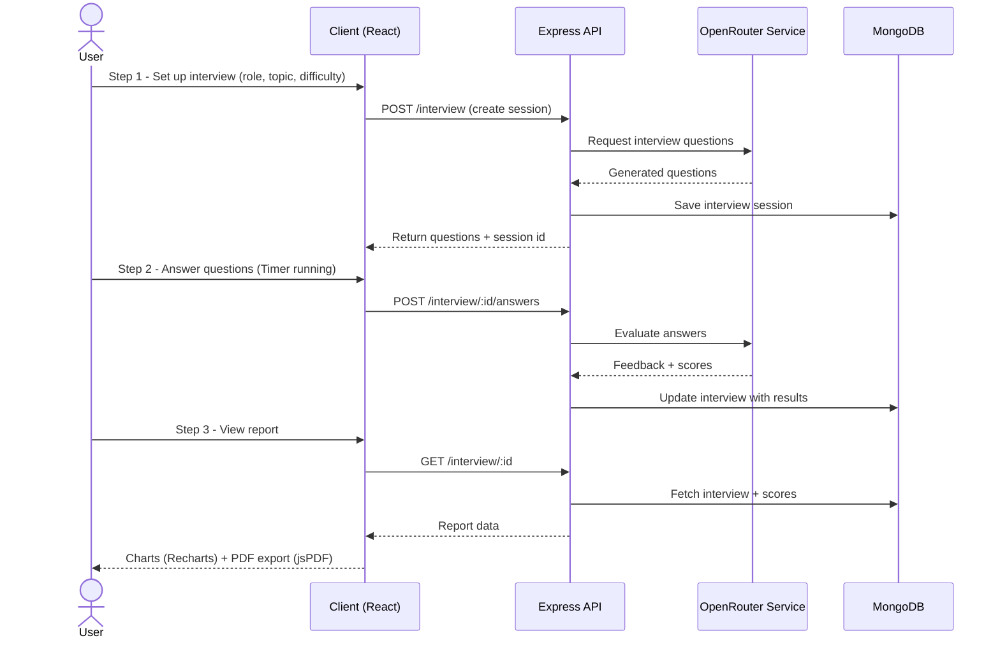
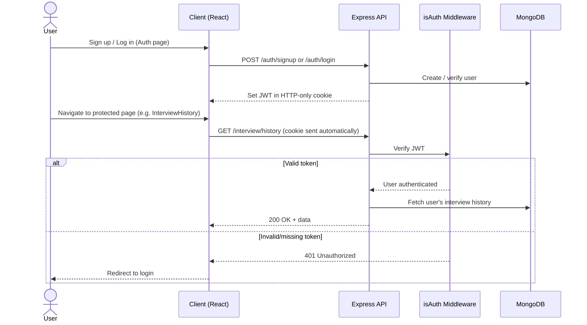
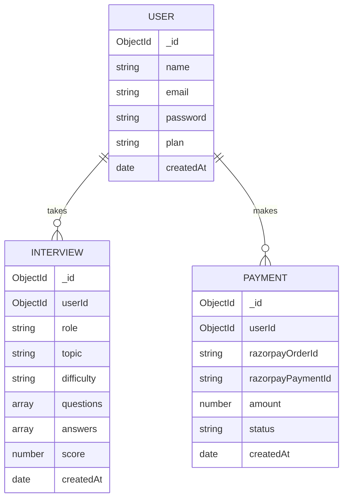

# InterviewIQ 🎯

InterviewIQ is a full-stack, AI-powered mock interview platform. Users set up a topic/role, go through a timed AI-driven interview, and receive a detailed scored report — with history tracking and paid plans built in.

**🔗 Live Demo:** [https://interview-iq-henna-mu.vercel.app/](https://interview-iq-henna-mu.vercel.app/)

**📦 Repository:** [https://github.com/Vanshrekhi/InterviewAgent](https://github.com/Vanshrekhi/InterviewAgent)

---

## Table of Contents

- [Features](#features)
- [Tech Stack](#tech-stack)
- [System Architecture](#system-architecture)
- [Interview Flow](#interview-flow)
- [Authentication Flow](#authentication-flow)
- [Data Model](#data-model)
- [Project Structure](#project-structure)
- [Getting Started](#getting-started)
- [Environment Variables](#environment-variables)
- [Deployment](#deployment)
- [License](#license)
- [Author](#author)

---

## Features

- 🔐 **Authentication** — JWT + cookie-based sessions
- 🎤 **AI mock interviews** — 3-step flow (Setup → Live Interview → Report), powered by an AI model via OpenRouter
- ⏱️ **Timed sessions** — built-in `Timer` component keeps interviews realistic
- 📊 **Scored reports** — visual breakdowns using Recharts, downloadable as PDF (jsPDF + AutoTable)
- 🕘 **Interview history** — every past session is saved and browsable
- 💳 **Payments** — Razorpay-powered pricing/subscription plans
- ⚡ **Modern UI** — React 19, Redux Toolkit, Tailwind CSS, Framer Motion animations

---

## Tech Stack

| Layer | Technologies |
|---|---|
| **Frontend** | React 19, Vite, Redux Toolkit, React Router DOM, Tailwind CSS, Axios, Firebase, Recharts, jsPDF/jsPDF-AutoTable, Framer Motion |
| **Backend** | Node.js, Express 5, MongoDB + Mongoose, JWT, cookie-parser, Multer, CORS, dotenv |
| **AI / Integrations** | OpenRouter (AI interview question generation & evaluation), Razorpay (payments), pdfjs-dist (PDF parsing, e.g. resume uploads) |
| **Deployment** | Vercel (frontend) |

---

## System Architecture



---

## Interview Flow

The core product experience — taking a mock interview — moves through three steps on the frontend, backed by AI-generated questions and scoring on the backend.



---

## Authentication Flow



---

## Data Model



---

## Project Structure

```
InterviewIQ/
├── client/                        # React frontend
│   ├── src/
│   │   ├── components/
│   │   │   ├── AuthModel.jsx
│   │   │   ├── Footer.jsx
│   │   │   ├── Navbar.jsx
│   │   │   ├── Step1SetUp.jsx
│   │   │   ├── Step2Interview.jsx
│   │   │   ├── Step3Report.jsx
│   │   │   └── Timer.jsx
│   │   ├── pages/
│   │   │   ├── Auth.jsx
│   │   │   ├── Home.jsx
│   │   │   ├── InterviewPage.jsx
│   │   │   ├── InterviewHistory.jsx
│   │   │   ├── InterviewReport.jsx
│   │   │   └── Pricing.jsx
│   │   ├── redux/
│   │   ├── utils/
│   │   ├── App.jsx
│   │   └── main.jsx
│   └── package.json
│
└── server/                        # Express backend
    ├── config/
    ├── controllers/
    │   ├── auth.controller.js
    │   ├── interview.controller.js
    │   ├── payment.controller.js
    │   └── user.controller.js
    ├── middlewares/
    │   ├── isAuth.js
    │   └── multer.js
    ├── models/
    │   ├── interview.model.js
    │   ├── payment.model.js
    │   └── user.model.js
    ├── routes/
    │   ├── auth.route.js
    │   ├── interview.route.js
    │   ├── payment.route.js
    │   └── user.route.js
    ├── services/
    │   ├── openRouter.service.js
    │   └── razorpay.service.js
    ├── index.js
    └── package.json
```

---

## Getting Started

### Prerequisites
- Node.js v18+
- A MongoDB instance (local or MongoDB Atlas)
- API keys for OpenRouter, Razorpay, and Firebase (see below)

### 1. Clone the repository
```bash
git clone https://github.com/Vanshrekhi/InterviewAgent
cd InterviewIQ
```

### 2. Set up the backend
```bash
cd server
npm install
cp .env.example .env   # create this file if it doesn't exist yet — see Environment Variables below
npm run dev
```
The server uses `nodemon` and starts from `index.js`.

### 3. Set up the frontend
```bash
cd ../client
npm install
npm run dev
```
The client runs on Vite's dev server (typically `http://localhost:5173`) and talks to the backend API.

### 4. Build for production
```bash
cd client
npm run build
```

---

## Environment Variables

Create a `.env` file inside `/server` with values similar to:

```env
PORT=5000
MONGO_URI=your_mongodb_connection_string
JWT_SECRET=your_jwt_secret
OPENROUTER_API_KEY=your_openrouter_api_key
RAZORPAY_KEY_ID=your_razorpay_key_id
RAZORPAY_KEY_SECRET=your_razorpay_key_secret
CLIENT_URL=http://localhost:5173
```

If the client uses Firebase (e.g. for auth or storage), add the relevant Firebase config to a `.env` file inside `/client` as well (prefixed with `VITE_`, per Vite convention).

> ⚠️ Never commit real `.env` files. Add them to `.gitignore` (already present in `/server`).

---

## Deployment

The frontend is deployed on **Vercel**:
👉 [https://interview-iq-henna-mu.vercel.app/](https://interview-iq-henna-mu.vercel.app/)

The backend (Express + MongoDB) needs to be deployed separately (e.g. Render, Railway, or a VPS) with the environment variables above configured, and `CLIENT_URL`/CORS updated to match the deployed frontend URL.

---

## License

No license specified yet. Consider adding one (e.g. MIT) if you plan to open this project up for contributions.

## Author

**Vansh Rekhi** - [vanshrekhi05@gmail.com]
